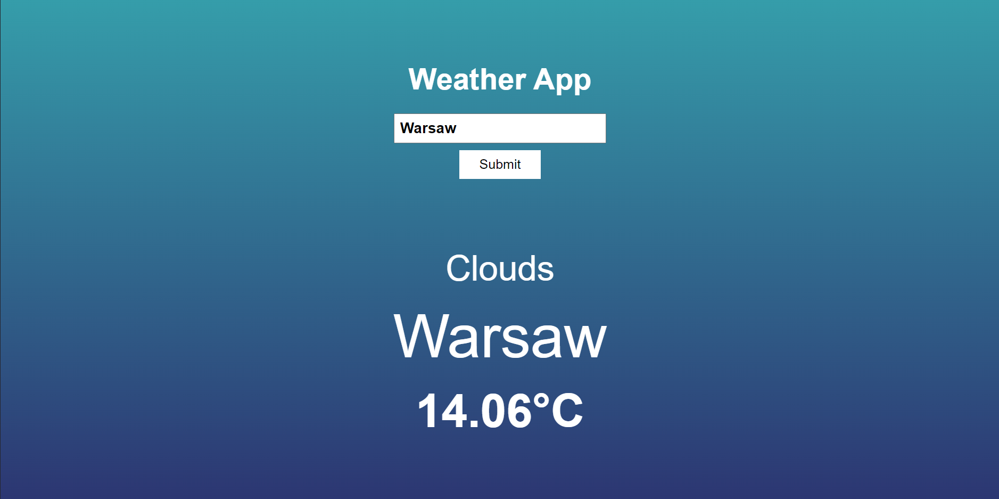

# Weather-App
Simple Weather App displaying the current weather in a specified place.

## Table of Contents
* [General Info](#general-information)
* [Technologies Used](#technologies-used)
* [Screenshots](#screenshots)

## General Information
A website displaying the current weather in a location typed by user worldwide. The information is retrieved from the REST API provided by [OpenWeatherMap.org](https://openweathermap.org).

## Technologies Used
- HTML
- CSS
- JavaScript

## Screenshots
